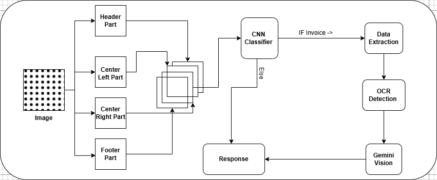

# VisionExtract
### Combining computer vision and data extraction.

### About
* This project is an AI-powered **document classification and data extraction system**. It takes an image as input, classifies it into predefined categories, and extracts relevant text using OCR. The classification model predicts the document type, and if it's a valid document, the extraction pipeline retrieves key information. Built using **FastAPI**, the backend integrates **machine learning models** for classification and text recognition. The system supports **image uploads** and processes them in real-time. It utilizes **TensorFlow/PyTorch** for deep learning and **Tesseract OCR** for text extraction. The project is designed for **automating document processing** in financial, legal, and administrative sectors. It aims to enhance accuracy, reduce manual effort, and improve efficiency in handling large-scale document workflows. 🚀


## Project WorkFlow 
- User Upload a **image** (hitting route)
- Route will take data nad passed to **CNN based Classifier**
- If image is an **invoice** we will then extract the data
- Using **Tesseract OCR** extract text and passed to **Gemnini Vision**
- It will give Structured JSON resposne 


### Project Architecture



## How to run?

1. Clone the repo in your local Machine
```bash
git clone https://github.com/aamiransari072/VisionExtract.git
```
2.  Creating Virtual Envoirment
```bash
python -m venv venv
```
3. Activating Virtual Envoirment
```bash
./venv/Scripts/activate  
```
4. Install all dependency

```bash
pip install requirements.txt
```

5. Download Dataset
```bash
Dataset : https://www.kaggle.com/datasets/shaz13/real-world-documents-collections
```

6. Run restructure_dataset.py
```bash
python restructure_dataset.py
```
7. Run fastapi app 
```bash
uvicorn app:app
```

8. Get Request on Train Route to train and Save model
```bash
get request on "/train" route
```

9. For classify and extract
```bash
post request on "/classify_and_extract" route
```
#### Note -  Key point to remember create a .env file and stored GOOGLE_API_KEY 

